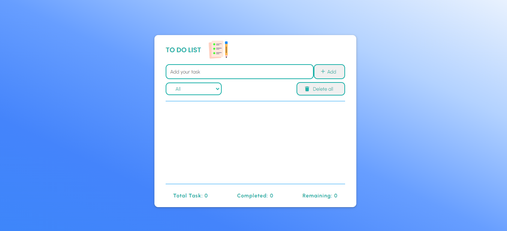

# TODO-App
# https://chandrakamalsingh-todoapp.netlify.app

<strong>This is my first project in web development using HTML,CSS,JAVASCRIPT and stored in Local storage.
 With functionalities like:-
<ul>
<li>Add task</li>
<li>Show task</li>
<li>Checked complete task</li>
<li>Delete all task</li>
<li>Delete particular task</li>
<li>Show total task,pending task and completed task</li>
<li>show task according to their value either completed or pending</li>
</ul>
</strong>

